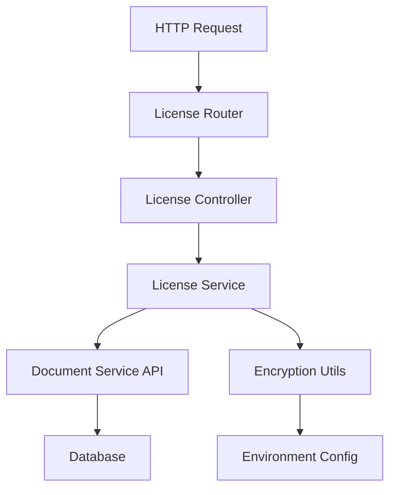

# Design Document: License Management System

## Overview

This design extends the existing Strapi license API with custom business logic for secure license key generation, validation, and activation. The system follows Strapi's Document Service API patterns and best practices by extending factory-generated controllers, services, and routers.

The core functionality includes:
- Secure license key generation using environment-based encryption
- Custom license creation with validation and defaults
- License activation endpoint with comprehensive validation
- Integration with Strapi's user permissions system

The design maintains separation of concerns with:
- **Service Layer**: Business logic, data validation, and encryption
- **Controller Layer**: HTTP request handling and response formatting
- **Router Layer**: Endpoint definitions and route configuration
- **Utility Layer**: Reusable encryption and validation functions

## Strapi Documentation References

When implementing this feature, refer to the official Strapi documentation for best practices:

- **Requests & Responses**: https://docs.strapi.io/cms/backend-customization/requests-responses
- **Routes**: https://docs.strapi.io/cms/backend-customization/routes
- **Middlewares**: https://docs.strapi.io/cms/backend-customization/middlewares
- **Controllers**: https://docs.strapi.io/cms/backend-customization/controllers
- **Services**: https://docs.strapi.io/cms/backend-customization/services
- **Models**: https://docs.strapi.io/cms/backend-customization/models
- **Webhooks**: https://docs.strapi.io/cms/backend-customization/webhooks

These resources should be consulted during implementation to ensure compliance with Strapi's latest API patterns and conventions.

## Architecture

### System Components



### Layer Responsibilities

**Router Layer** (`routes/license.ts`)
- Defines HTTP endpoints (core + custom routes)
- Maps routes to controller methods
- Extends core router using `factories.createCoreRouter`

**Controller Layer** (`controllers/license.ts`)
- Handles HTTP requests and responses
- Validates request parameters
- Calls service layer methods
- Formats responses with appropriate status codes
- Extends core controller using `factories.createCoreController`

**Service Layer** (`services/license.ts`)
- Implements business logic
- Validates data against business rules
- Generates license keys
- Interacts with Document Service API
- Extends core service using `factories.createCoreService`

**Utility Layer** (`utils/encryption.ts`)
- Provides encryption/decryption functions
- Manages encryption key access
- Handles cryptographic operations

### Data Flow

**License Creation Flow:**
1. Client sends POST request to `/api/licenses`
2. Router routes to controller's create method
3. Controller delegates to service's create method
4. Service validates input data
5. Service generates encrypted license key
6. Service calls parent create method (Document Service API)
7. Database persists license with generated key
8. Response returns created license object

**License Activation Flow:**
1. Client sends POST request to `/api/licenses/activate` with license key
2. Router routes to controller's activate method
3. Controller extracts license key from request
4. Controller queries service to find license by key
5. Service validates license ownership, expiration, and status
6. Service updates isActive to true
7. Response returns activation status

## Components and Interfaces

### License Service

**File**: `src/api/license/services/license.ts`

**Purpose**: Extends core service with custom license creation logic and secure key generation.

**Key Methods**:

```typescript
interface LicenseService {
  // Override core create method
  create(params: {
    data: LicenseCreateInput;
    // Additional Strapi params
  }): Promise<License>;
  
  // Inherited from core service
  findOne(documentId: string, params?: any): Promise<License>;
  update(documentId: string, params: any): Promise<License>;
  // ... other core methods
}

interface LicenseCreateInput {
  expirationType: 'perpetual' | 'expiring';
  maxSeats: number;
  expireAt?: string; // ISO datetime, required if expirationType is 'expiring'
  user: string; // User document ID
}

interface License {
  documentId: string;
  licenseKey: string;
  maxSeats: number;
  expireAt?: string;
  expirationType: 'perpetual' | 'expiring';
  isActive: boolean;
  user: UserReference;
  seats: KeySeatReference[];
  createdAt: string;
  updatedAt: string;
}
```

**Implementation Strategy**:
- Extend `factories.createCoreService('api::license.license')`
- Override `create` method to add validation and key generation
- Call `super.create()` to leverage Document Service API
- Validate required fields before processing
- Generate license key using encryption utility
- Set default values (isActive: false)

### License Controller

**File**: `src/api/license/controllers/license.ts`

**Purpose**: Handles HTTP requests for license operations, including custom activation endpoint.

**Key Methods**:

```typescript
interface LicenseController {
  // Custom activation endpoint
  activate(ctx: Context): Promise<void>;
  
  // Inherited core methods
  find(ctx: Context): Promise<void>;
  findOne(ctx: Context): Promise<void>;
  create(ctx: Context): Promise<void>;
  update(ctx: Context): Promise<void>;
  delete(ctx: Context): Promise<void>;
}

interface Context {
  request: {
    body: any;
    query: any;
  };
  params: {
    id?: string;
  };
  state: {
    user?: User; // Authenticated user from JWT
  };
  body: any; // Response body
  status: number; // HTTP status code
}
```

**Activation Endpoint Logic**:
1. Extract `licenseKey` from request body
2. Query license by licenseKey using service
3. Validate license exists (404 if not found)
4. Validate license belongs to authenticated user (403 if not)
5. Validate license not expired (400 if expired)
6. Validate license not already active (409 if already active)
7. Update license isActive to true
8. Return success response with activation details

### License Router

**File**: `src/api/license/routes/license.ts`

**Purpose**: Defines HTTP routes for license API, including custom activation route.

**Route Configuration**:

```typescript
interface RouterConfig {
  routes: Route[];
}

interface Route {
  method: 'GET' | 'POST' | 'PUT' | 'DELETE';
  path: string;
  handler: string; // Format: 'controller.method'
  config?: {
    policies?: string[];
    middlewares?: string[];
  };
}
```

**Custom Routes**:
- `POST /api/licenses/activate` → `license.activate`

**Core Routes** (inherited):
- `GET /api/licenses` → `license.find`
- `GET /api/licenses/:id` → `license.findOne`
- `POST /api/licenses` → `license.create`
- `PUT /api/licenses/:id` → `license.update`
- `DELETE /api/licenses/:id` → `license.delete`

### Encryption Utility

**File**: `src/api/license/utils/encryption.ts`

**Purpose**: Provides secure encryption and decryption for license keys.

**Interface**:

```typescript
interface EncryptionUtils {
  generateLicenseKey(data: LicenseKeyData): string;
  decryptLicenseKey(licenseKey: string): LicenseKeyData | null;
  getEncryptionKey(): string;
}

interface LicenseKeyData {
  expirationType: 'perpetual' | 'expiring';
  maxSeats: number;
  userId: string;
  expireAt?: string;
  timestamp: number; // Creation timestamp
}
```

**Implementation Details**:
- Use Node.js `crypto` module for encryption
- Algorithm: AES-256-GCM (authenticated encryption)
- Key source: `process.env.ENCRYPTION_KEY`
- Encode encrypted data as base64 string
- Include initialization vector (IV) in output
- Include authentication tag for integrity verification

**Key Generation Process**:
1. Read encryption key from environment
2. Create JSON payload with license metadata
3. Generate random IV
4. Encrypt payload using AES-256-GCM
5. Combine IV + encrypted data + auth tag
6. Encode as base64 string
7. Return formatted license key

## Data Models

### License Schema

The license content type schema is already defined in `src/api/license/content-types/license/schema.json`:

```json
{
  "attributes": {
    "licenseKey": {
      "type": "string"
    },
    "maxSeats": {
      "type": "integer"
    },
    "expireAt": {
      "type": "datetime"
    },
    "expirationType": {
      "type": "enumeration",
      "enum": ["perpetual", "expiring"]
    },
    "isActive": {
      "type": "boolean",
      "default": false
    },
    "seats": {
      "type": "relation",
      "relation": "oneToMany",
      "target": "api::key-seat.key-seat"
    },
    "user": {
      "type": "relation",
      "relation": "manyToOne",
      "target": "plugin::users-permissions.user"
    }
  }
}
```

**Field Descriptions**:
- `licenseKey`: Encrypted string containing license metadata
- `maxSeats`: Maximum number of seats allowed for this license
- `expireAt`: Expiration datetime (null for perpetual licenses)
- `expirationType`: Enum indicating perpetual or expiring license
- `isActive`: Boolean flag indicating if license is activated
- `seats`: One-to-many relation to key-seat entities
- `user`: Many-to-one relation to user who owns the license

### Validation Rules

**License Creation**:
- `expirationType`: Required, must be 'perpetual' or 'expiring'
- `maxSeats`: Required, must be positive integer (> 0)
- `expireAt`: Required if expirationType is 'expiring', must be future date
- `user`: Required, must reference valid user document ID
- `isActive`: Auto-set to false, cannot be set during creation

**License Activation**:
- `licenseKey`: Required, must exist in database
- License must belong to authenticated user
- License must not be expired (if expiring type)
- License must not already be active

## Correctness Properties


*A property is a characteristic or behavior that should hold true across all valid executions of a system—essentially, a formal statement about what the system should do. Properties serve as the bridge between human-readable specifications and machine-verifiable correctness guarantees.*

### Property 1: License Creation Generates Encrypted Key with Metadata

*For any* valid license creation request with expirationType, maxSeats, and user reference, the created license SHALL have a non-empty licenseKey that, when decrypted, contains the expirationType, maxSeats, and user reference.

**Validates: Requirements 1.1, 1.2, 1.3, 1.4, 2.8**

### Property 2: Required Fields Validation

*For any* license creation request missing required fields (expirationType, maxSeats, or user), the License_Service SHALL return an error indicating which fields are missing.

**Validates: Requirements 2.2, 6.7**

### Property 3: Expiration Type Validation

*For any* license creation request with an expirationType value other than 'perpetual' or 'expiring', the License_Service SHALL reject the request with a validation error.

**Validates: Requirements 2.3**

### Property 4: Conditional Expiration Date Validation

*For any* license creation request with expirationType set to 'expiring', if expireAt is not provided or is not a future date, the License_Service SHALL reject the request with a validation error.

**Validates: Requirements 2.4**

### Property 5: Positive Seats Validation

*For any* license creation request with maxSeats less than or equal to zero, the License_Service SHALL reject the request with a validation error.

**Validates: Requirements 2.5**

### Property 6: User Association

*For any* successfully created license with a user reference, querying that license SHALL return the associated user relationship.

**Validates: Requirements 2.6**

### Property 7: Default Inactive Status

*For any* license creation request that does not explicitly set isActive, the created license SHALL have isActive set to false.

**Validates: Requirements 2.7**

### Property 8: Validation Errors Return Descriptive Messages

*For any* validation error during license creation, the License_Service SHALL return an error object containing a descriptive message about what validation failed.

**Validates: Requirements 2.10, 6.1**

### Property 9: Activation Validates Ownership

*For any* activation request where the license key belongs to a different user than the authenticated requester, the License_Controller SHALL return a 403 Forbidden error.

**Validates: Requirements 3.4, 3.10**

### Property 10: Activation Validates Expiration

*For any* activation request for a license with expirationType 'expiring' where the current date is after expireAt, the License_Controller SHALL return a 400 Bad Request error.

**Validates: Requirements 3.5, 3.11**

### Property 11: Activation Validates Not Already Active

*For any* activation request for a license where isActive is already true, the License_Controller SHALL return a 409 Conflict error.

**Validates: Requirements 3.6, 3.12**

### Property 12: Activation Validates Key Exists

*For any* activation request with a license key that does not exist in the database, the License_Controller SHALL return a 404 Not Found error.

**Validates: Requirements 3.3, 3.9**

### Property 13: Successful Activation Sets Active Status

*For any* valid activation request that passes all validation checks, the License_Controller SHALL update the license's isActive field to true and return a success response.

**Validates: Requirements 3.7, 3.8**

### Property 14: Exception Handling Returns 500

*For any* unexpected exception that occurs during license operations, the License_Controller SHALL catch the exception and return a 500 Internal Server Error with a generic error message.

**Validates: Requirements 6.5**

### Property 15: Validation Errors Return Appropriate Status Codes

*For any* validation error during license operations, the License_Controller SHALL return an HTTP status code in the 400 range (400, 403, 404, 409) appropriate to the type of validation failure.

**Validates: Requirements 6.2**

### Property 16: Type Validation

*For any* license creation request where field types do not match the schema (e.g., maxSeats is not an integer), the License_Service SHALL reject the request with a type validation error.

**Validates: Requirements 6.6**

## Error Handling

### Error Categories

**Validation Errors** (400 Bad Request)
- Missing required fields
- Invalid expirationType value
- Missing expireAt for expiring licenses
- Non-positive maxSeats value
- Invalid data types
- Expired license activation attempt

**Authentication Errors** (401 Unauthorized)
- Missing or invalid JWT token
- Unauthenticated activation request

**Authorization Errors** (403 Forbidden)
- Attempting to activate license owned by different user
- Attempting to access license without permission

**Not Found Errors** (404 Not Found)
- License key does not exist in database
- Referenced user does not exist

**Conflict Errors** (409 Conflict)
- Attempting to activate already-active license

**Configuration Errors** (500 Internal Server Error)
- Missing ENCRYPTION_KEY environment variable
- Encryption/decryption failures

**Server Errors** (500 Internal Server Error)
- Unexpected exceptions
- Database connection failures
- Unhandled errors

### Error Response Format

All errors should follow a consistent format:

```typescript
interface ErrorResponse {
  error: {
    status: number;
    name: string;
    message: string;
    details?: any; // Additional context (e.g., missing fields)
  };
}
```

**Example Error Responses**:

```json
// Validation Error
{
  "error": {
    "status": 400,
    "name": "ValidationError",
    "message": "maxSeats must be a positive integer",
    "details": {
      "field": "maxSeats",
      "value": -5
    }
  }
}

// Authorization Error
{
  "error": {
    "status": 403,
    "name": "ForbiddenError",
    "message": "You do not have permission to activate this license"
  }
}

// Not Found Error
{
  "error": {
    "status": 404,
    "name": "NotFoundError",
    "message": "License key not found"
  }
}
```

### Error Handling Strategy

**Service Layer**:
- Validate all inputs before processing
- Throw descriptive errors for validation failures
- Check encryption key availability before operations
- Let Document Service API errors propagate

**Controller Layer**:
- Wrap service calls in try-catch blocks
- Map service errors to appropriate HTTP status codes
- Log errors with sufficient context for debugging
- Return user-friendly error messages (avoid exposing internal details)
- Sanitize error messages to prevent information leakage

**Logging**:
- Log all errors with timestamp, user context, and stack trace
- Use different log levels (error, warn, info)
- Include request ID for tracing
- Avoid logging sensitive data (encryption keys, full license keys)

## Testing Strategy

### Dual Testing Approach

The license management system requires both unit tests and property-based tests for comprehensive coverage:

**Unit Tests**: Verify specific examples, edge cases, and error conditions
- Specific example: Creating a perpetual license with valid data
- Specific example: Activating a valid license successfully
- Edge case: Creating license with expireAt exactly at current time
- Edge case: Activating license with expireAt exactly at current time
- Error condition: Missing ENCRYPTION_KEY environment variable
- Error condition: Attempting to activate non-existent license key
- Integration: Verifying user relationship is properly established

**Property-Based Tests**: Verify universal properties across all inputs
- Generate random valid license data and verify key generation
- Generate random invalid expirationType values and verify rejection
- Generate random non-positive maxSeats values and verify rejection
- Generate random license data and verify default isActive is false
- Generate random expired licenses and verify activation rejection

### Property-Based Testing Configuration

**Library**: Use `fast-check` for TypeScript/JavaScript property-based testing

**Configuration**:
- Minimum 100 iterations per property test
- Each test must reference its design document property
- Tag format: `Feature: license-management-system, Property {number}: {property_text}`

**Example Property Test Structure**:

```typescript
// Feature: license-management-system, Property 1: License Creation Generates Encrypted Key with Metadata
test('generated license key contains all metadata', async () => {
  await fc.assert(
    fc.asyncProperty(
      fc.record({
        expirationType: fc.constantFrom('perpetual', 'expiring'),
        maxSeats: fc.integer({ min: 1, max: 1000 }),
        userId: fc.uuid(),
        expireAt: fc.option(fc.date({ min: new Date() }))
      }),
      async (licenseData) => {
        const license = await strapi.service('api::license.license').create({
          data: licenseData
        });
        
        const decrypted = decryptLicenseKey(license.licenseKey);
        expect(decrypted.expirationType).toBe(licenseData.expirationType);
        expect(decrypted.maxSeats).toBe(licenseData.maxSeats);
        expect(decrypted.userId).toBe(licenseData.userId);
      }
    ),
    { numRuns: 100 }
  );
});
```

### Test Coverage Goals

- **Service Layer**: 100% coverage of validation logic and key generation
- **Controller Layer**: 100% coverage of error handling and response formatting
- **Utility Layer**: 100% coverage of encryption/decryption functions
- **Integration**: All API endpoints tested with valid and invalid requests

### Testing Considerations

**Encryption Testing**:
- Test with valid encryption key
- Test with missing encryption key
- Test encryption/decryption round-trip
- Verify encrypted keys are not predictable

**Database Testing**:
- Use test database or in-memory database
- Clean up test data after each test
- Test with existing and non-existing records

**Authentication Testing**:
- Mock authenticated user context
- Test with different user permissions
- Verify ownership checks work correctly

**Date/Time Testing**:
- Mock current time for consistent expiration testing
- Test with dates in past, present, and future
- Test timezone handling

