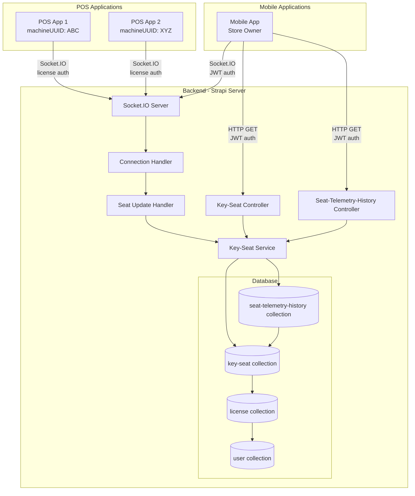
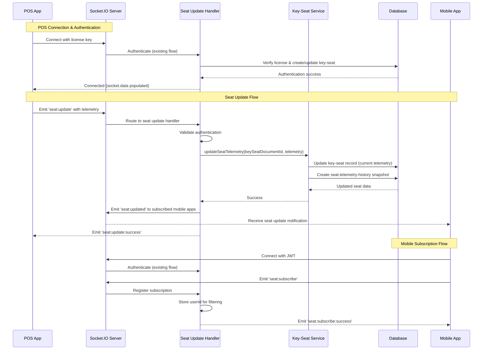
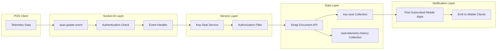
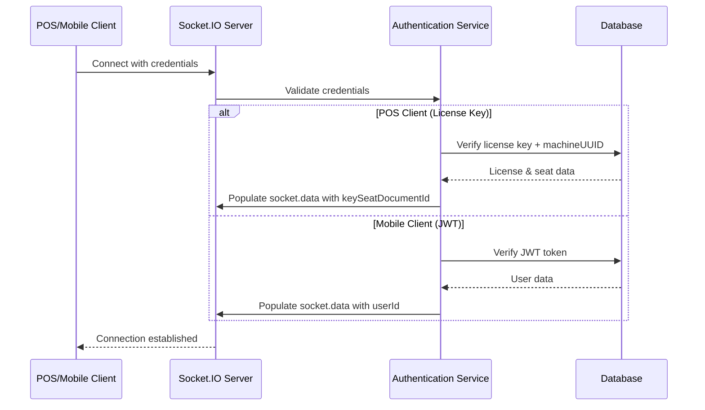

# Design Document: POS Seat Realtime Updates

## Overview

This feature enables bidirectional real-time communication between POS applications and mobile store owner applications through Socket.IO. POS machines can send telemetry and status updates to the backend, which are persisted in the database and broadcast to subscribed mobile apps in real-time. The design leverages the existing Socket.IO infrastructure, authentication mechanisms, and Strapi Document Service API patterns.

### Key Capabilities

- POS applications emit seat updates with telemetry data via Socket.IO
- Backend persists telemetry to the key-seat collection using Strapi Document Service API
- Mobile apps fetch all their seats via HTTP REST endpoint
- Mobile apps subscribe to real-time seat updates via Socket.IO
- Authorization ensures users only access their own seat data
- Integration with existing connection handler and authentication flow

### Design Goals

1. Maintain backward compatibility with existing Socket.IO infrastructure
2. Follow established Strapi patterns (Document Service API, factory pattern)
3. Ensure data security through proper authentication and authorization
4. Provide consistent event naming following existing conventions
5. Enable offline-first POS operation with opportunistic real-time sync

## Architecture

### High-Level System Architecture



### Component Interaction Flow



### Data Flow Architecture



## Components and Interfaces

### Socket.IO Event Constants

Following the existing pattern in `src/socketio/events_constants.ts`, new events will be added to the `SocketIOEvents` class:

```typescript
export class SocketIOEvents {
  // ... existing events ...
  
  /**
   * Event emitted by POS app to update seat telemetry data
   */
  static readonly OnSeatUpdate = "seat:update";
  
  /**
   * Event emitted to POS app confirming successful seat update
   */
  static readonly EmitSeatUpdateSuccess = "seat:update:success";
  
  /**
   * Event emitted by mobile app to subscribe to seat updates
   */
  static readonly OnSeatSubscribe = "seat:subscribe";
  
  /**
   * Event emitted to mobile app confirming subscription
   */
  static readonly EmitSeatSubscribeSuccess = "seat:subscribe:success";
  
  /**
   * Event emitted to subscribed mobile apps when seat data changes
   */
  static readonly EmitSeatUpdated = "seat:updated";
  
  /**
   * Event emitted by mobile app to unsubscribe from seat updates
   */
  static readonly OnSeatUnsubscribe = "seat:unsubscribe";
}
```

### Socket.IO Event Handlers

New handler file: `src/socketio/handlers/seat-update.handler.ts`

```typescript
import { Server as SocketIOServer, Socket } from 'socket.io';
import type { Core } from '@strapi/strapi';
import { SocketIOEvents } from '../events_constants';

interface SeatUpdatePayload {
  telemetry: Record<string, any>;
}

interface SeatSubscribePayload {
  // Empty for now, may include filters in future
}

/**
 * Sets up seat update event handlers
 */
export function setupSeatUpdateHandlers(
  io: SocketIOServer,
  strapi: Core.Strapi
): void {
  io.on('connection', (socket: Socket) => {
    // Only set up handlers for authenticated sockets
    if (!socket.data?.userId) {
      return;
    }

    // POS: Handle seat update events
    if (socket.data.clientType === 'pos') {
      handlePOSSeatUpdate(socket, strapi, io);
    }

    // Mobile: Handle seat subscription events
    if (socket.data.clientType === 'mobile') {
      handleMobileSeatSubscription(socket, strapi);
    }
  });
}

/**
 * Handles seat update events from POS clients
 */
function handlePOSSeatUpdate(
  socket: Socket,
  strapi: Core.Strapi,
  io: SocketIOServer
): void {
  socket.on(SocketIOEvents.OnSeatUpdate, async (payload: SeatUpdatePayload) => {
    try {
      const { keySeatDocumentId, machineUUID } = socket.data;

      if (!keySeatDocumentId) {
        socket.emit(SocketIOEvents.EmitSeatUpdateSuccess, {
          success: false,
          error: 'No seat associated with this connection'
        });
        return;
      }

      // Update seat telemetry via service
      const service = strapi.service('api::key-seat.key-seat');
      const updatedSeat = await service.updateSeatTelemetry(
        keySeatDocumentId,
        payload.telemetry
      );

      // Emit success to POS
      socket.emit(SocketIOEvents.EmitSeatUpdateSuccess, {
        success: true,
        updatedAt: updatedSeat.updatedAt
      });

      // Notify subscribed mobile apps
      await notifyMobileAppsOfSeatUpdate(
        io,
        strapi,
        updatedSeat,
        socket.data.userId
      );

      strapi.log.info(`[SeatUpdateHandler] Seat updated: ${keySeatDocumentId}`);
    } catch (error) {
      strapi.log.error(`[SeatUpdateHandler] Error updating seat: ${error}`);
      socket.emit(SocketIOEvents.EmitSeatUpdateSuccess, {
        success: false,
        error: 'Failed to update seat data'
      });
    }
  });
}

/**
 * Handles seat subscription events from mobile clients
 */
function handleMobileSeatSubscription(
  socket: Socket,
  strapi: Core.Strapi
): void {
  socket.on(SocketIOEvents.OnSeatSubscribe, async (payload: SeatSubscribePayload) => {
    try {
      const { userId, documentId } = socket.data;

      // Join a user-specific room for seat updates
      const roomName = `user:${documentId}:seats`;
      socket.join(roomName);

      socket.emit(SocketIOEvents.EmitSeatSubscribeSuccess, {
        success: true,
        message: 'Subscribed to seat updates'
      });

      strapi.log.info(`[SeatUpdateHandler] Mobile app subscribed to seats: ${documentId}`);
    } catch (error) {
      strapi.log.error(`[SeatUpdateHandler] Error subscribing to seats: ${error}`);
      socket.emit(SocketIOEvents.EmitSeatSubscribeSuccess, {
        success: false,
        error: 'Failed to subscribe to seat updates'
      });
    }
  });

  socket.on(SocketIOEvents.OnSeatUnsubscribe, async () => {
    try {
      const { documentId } = socket.data;
      const roomName = `user:${documentId}:seats`;
      socket.leave(roomName);

      strapi.log.info(`[SeatUpdateHandler] Mobile app unsubscribed from seats: ${documentId}`);
    } catch (error) {
      strapi.log.error(`[SeatUpdateHandler] Error unsubscribing from seats: ${error}`);
    }
  });
}

/**
 * Notifies all subscribed mobile apps of a seat update
 */
async function notifyMobileAppsOfSeatUpdate(
  io: SocketIOServer,
  strapi: Core.Strapi,
  updatedSeat: any,
  userDocumentId: string
): Promise<void> {
  try {
    // Get the license to find the owner
    const license = await strapi.documents('api::license.license').findOne({
      documentId: updatedSeat.license,
      populate: ['user']
    });

    if (!license || !license.user) {
      strapi.log.warn(`[SeatUpdateHandler] No license/user found for seat ${updatedSeat.documentId}`);
      return;
    }

    const ownerDocumentId = typeof license.user === 'object' 
      ? license.user.documentId 
      : license.user;

    // Emit to user-specific room
    const roomName = `user:${ownerDocumentId}:seats`;
    io.to(roomName).emit(SocketIOEvents.EmitSeatUpdated, {
      machineUUID: updatedSeat.machineUUID,
      telemetry: updatedSeat.telemetry,
      isActive: updatedSeat.isActive,
      updatedAt: updatedSeat.updatedAt,
      licenseDocumentId: updatedSeat.license
    });

    strapi.log.info(`[SeatUpdateHandler] Notified mobile apps in room ${roomName}`);
  } catch (error) {
    strapi.log.error(`[SeatUpdateHandler] Error notifying mobile apps: ${error}`);
  }
}
```

### Key-Seat Service

Extended service in `src/api/key-seat/services/key-seat.ts`:

```typescript
import { factories } from '@strapi/strapi';

export default factories.createCoreService('api::key-seat.key-seat', ({ strapi }) => ({
  /**
   * Updates seat telemetry data and creates historical snapshot
   * @param keySeatDocumentId - Document ID of the key-seat
   * @param telemetry - Telemetry data object
   * @returns Updated key-seat document
   */
  async updateSeatTelemetry(
    keySeatDocumentId: string,
    telemetry: Record<string, any>
  ) {
    // Validate seat exists
    const existingSeat = await strapi.documents('api::key-seat.key-seat').findOne({
      documentId: keySeatDocumentId
    });

    if (!existingSeat) {
      throw new Error(`Key-seat not found: ${keySeatDocumentId}`);
    }

    // Update current telemetry in key-seat
    const updatedSeat = await strapi.documents('api::key-seat.key-seat').update({
      documentId: keySeatDocumentId,
      data: {
        telemetry: {
          ...telemetry,
          lastUpdated: new Date().toISOString()
        }
      }
    });

    // Create historical snapshot asynchronously (non-blocking)
    this.createTelemetrySnapshot(keySeatDocumentId, telemetry, 'realtime')
      .catch(error => {
        strapi.log.error('[KeySeatService] Failed to create telemetry snapshot:', {
          keySeatDocumentId,
          error: error.message
        });
      });

    return updatedSeat;
  },

  /**
   * Creates a historical telemetry snapshot
   * @param keySeatDocumentId - Document ID of the key-seat
   * @param telemetryData - Telemetry data to snapshot
   * @param snapshotType - Type of snapshot (realtime, hourly, daily)
   * @returns Created snapshot document
   */
  async createTelemetrySnapshot(
    keySeatDocumentId: string,
    telemetryData: Record<string, any>,
    snapshotType: 'realtime' | 'hourly' | 'daily' = 'realtime'
  ) {
    try {
      const snapshot = await strapi.documents('api::seat-telemetry-history.seat-telemetry-history').create({
        data: {
          keySeat: keySeatDocumentId,
          telemetryData,
          capturedAt: new Date().toISOString(),
          snapshotType
        }
      });

      return snapshot;
    } catch (error) {
      strapi.log.error('[KeySeatService] Error creating telemetry snapshot:', {
        keySeatDocumentId,
        snapshotType,
        error: error.message
      });
      throw error;
    }
  },

  /**
   * Gets telemetry history for a seat with date range filtering
   * @param keySeatDocumentId - Document ID of the key-seat
   * @param startDate - Start date for filtering (ISO string)
   * @param endDate - End date for filtering (ISO string)
   * @param page - Page number for pagination
   * @param pageSize - Number of records per page
   * @returns Array of telemetry history records
   */
  async getSeatTelemetryHistory(
    keySeatDocumentId: string,
    startDate?: string,
    endDate?: string,
    page: number = 1,
    pageSize: number = 100
  ) {
    const filters: any = {
      keySeat: {
        documentId: keySeatDocumentId
      }
    };

    // Add date range filters if provided
    if (startDate || endDate) {
      filters.capturedAt = {};
      if (startDate) {
        filters.capturedAt.$gte = startDate;
      }
      if (endDate) {
        filters.capturedAt.$lte = endDate;
      }
    }

    const history = await strapi.documents('api::seat-telemetry-history.seat-telemetry-history').findMany({
      filters,
      sort: { capturedAt: 'desc' },
      start: (page - 1) * pageSize,
      limit: pageSize,
      populate: ['keySeat']
    });

    return history;
  },

  /**
   * Gets all seats for a user
   * @param userDocumentId - Document ID of the user
   * @returns Array of key-seat documents with populated relations
   */
  async getUserSeats(userDocumentId: string) {
    // Find all licenses for the user
    const licenses = await strapi.documents('api::license.license').findMany({
      filters: {
        user: {
          documentId: userDocumentId
        }
      },
      populate: ['seats']
    });

    // Extract all seats from all licenses
    const allSeats = licenses.flatMap(license => 
      (license.seats || []).map(seat => ({
        ...seat,
        licenseDocumentId: license.documentId,
        licenseKey: license.licenseKey,
        planSubscriptionType: license.planSubscriptionType
      }))
    );

    return allSeats;
  }
}));
```

### Key-Seat Controller

Extended controller in `src/api/key-seat/controllers/key-seat.ts`:

```typescript
import { factories } from '@strapi/strapi';

export default factories.createCoreController('api::key-seat.key-seat', ({ strapi }) => ({
  /**
   * GET /api/key-seats/my-seats
   * Fetches all seats owned by the authenticated user
   */
  async mySeats(ctx) {
    try {
      // Extract authenticated user from JWT
      const user = ctx.state.user;

      if (!user) {
        return ctx.unauthorized('Authentication required');
      }

      // Get user's document ID
      const userDocumentId = user.documentId;

      // Fetch seats via service
      const service = strapi.service('api::key-seat.key-seat');
      const seats = await service.getUserSeats(userDocumentId);

      return ctx.send({
        data: seats,
        meta: {
          total: seats.length
        }
      });
    } catch (error) {
      strapi.log.error('[KeySeatController] Error fetching user seats:', error);
      return ctx.internalServerError('Failed to fetch seats');
    }
  }
}));
```

### Seat-Telemetry-History Controller

New controller in `src/api/seat-telemetry-history/controllers/seat-telemetry-history.ts`:

```typescript
import { factories } from '@strapi/strapi';

export default factories.createCoreController('api::seat-telemetry-history.seat-telemetry-history', ({ strapi }) => ({
  /**
   * GET /api/seat-telemetry-history/query
   * Queries telemetry history with filtering and pagination
   * Query params:
   *   - machineUUID: Filter by machine UUID
   *   - startDate: ISO date string for range start
   *   - endDate: ISO date string for range end
   *   - page: Page number (default: 1)
   *   - pageSize: Records per page (default: 100, max: 1000)
   */
  async queryTelemetryHistory(ctx) {
    try {
      // Extract authenticated user from JWT
      const user = ctx.state.user;

      if (!user) {
        return ctx.unauthorized('Authentication required');
      }

      const userDocumentId = user.documentId;
      const { machineUUID, startDate, endDate, page = 1, pageSize = 100 } = ctx.query;

      // Validate pagination parameters
      const validatedPage = Math.max(1, parseInt(page as string, 10));
      const validatedPageSize = Math.min(1000, Math.max(1, parseInt(pageSize as string, 10)));

      // If machineUUID is provided, find the seat and verify ownership
      let keySeatDocumentId: string | null = null;

      if (machineUUID) {
        // Find the seat by machineUUID
        const seats = await strapi.documents('api::key-seat.key-seat').findMany({
          filters: {
            machineUUID: machineUUID as string
          },
          populate: ['license.user']
        });

        if (seats.length === 0) {
          return ctx.notFound('Seat not found');
        }

        const seat = seats[0];

        // Verify ownership through license relation
        const license = await strapi.documents('api::license.license').findOne({
          documentId: seat.license,
          populate: ['user']
        });

        if (!license) {
          return ctx.notFound('License not found');
        }

        const ownerDocumentId = typeof license.user === 'object' 
          ? license.user.documentId 
          : license.user;

        if (ownerDocumentId !== userDocumentId) {
          return ctx.forbidden('You do not have access to this seat');
        }

        keySeatDocumentId = seat.documentId;
      } else {
        // If no machineUUID, return history for all user's seats
        const service = strapi.service('api::key-seat.key-seat');
        const userSeats = await service.getUserSeats(userDocumentId);

        if (userSeats.length === 0) {
          return ctx.send({
            data: [],
            meta: {
              page: validatedPage,
              pageSize: validatedPageSize,
              total: 0
            }
          });
        }

        // Query history for all user's seats
        const allHistory = [];
        for (const seat of userSeats) {
          const history = await service.getSeatTelemetryHistory(
            seat.documentId,
            startDate as string,
            endDate as string,
            validatedPage,
            validatedPageSize
          );
          allHistory.push(...history);
        }

        // Sort by capturedAt descending
        allHistory.sort((a, b) => 
          new Date(b.capturedAt).getTime() - new Date(a.capturedAt).getTime()
        );

        // Apply pagination to combined results
        const start = (validatedPage - 1) * validatedPageSize;
        const paginatedHistory = allHistory.slice(start, start + validatedPageSize);

        return ctx.send({
          data: paginatedHistory,
          meta: {
            page: validatedPage,
            pageSize: validatedPageSize,
            total: allHistory.length
          }
        });
      }

      // Query history for specific seat
      const service = strapi.service('api::key-seat.key-seat');
      const history = await service.getSeatTelemetryHistory(
        keySeatDocumentId,
        startDate as string,
        endDate as string,
        validatedPage,
        validatedPageSize
      );

      return ctx.send({
        data: history,
        meta: {
          page: validatedPage,
          pageSize: validatedPageSize,
          total: history.length
        }
      });
    } catch (error) {
      strapi.log.error('[SeatTelemetryHistoryController] Error querying telemetry history:', error);
      return ctx.internalServerError('Failed to query telemetry history');
    }
  }
}));
```

### Custom Route Configuration

New route file: `src/api/key-seat/routes/custom-routes.ts`

```typescript
export default {
  routes: [
    {
      method: 'GET',
      path: '/key-seats/my-seats',
      handler: 'key-seat.mySeats',
      config: {
        policies: [],
        middlewares: []
      }
    }
  ]
};
```

New route file: `src/api/seat-telemetry-history/routes/custom-routes.ts`

```typescript
export default {
  routes: [
    {
      method: 'GET',
      path: '/seat-telemetry-history/query',
      handler: 'seat-telemetry-history.queryTelemetryHistory',
      config: {
        policies: [],
        middlewares: []
      }
    }
  ]
};
```

## Data Models

### Key-Seat Collection Schema

Updated schema with telemetryHistory relation:

```json
{
  "kind": "collectionType",
  "collectionName": "key_seats",
  "info": {
    "singularName": "key-seat",
    "pluralName": "key-seats",
    "displayName": "Key-Seat"
  },
  "options": {
    "draftAndPublish": true
  },
  "attributes": {
    "machineUUID": {
      "type": "string"
    },
    "userSocketId": {
      "type": "string"
    },
    "telemetry": {
      "type": "json"
    },
    "isActive": {
      "type": "boolean",
      "default": false
    },
    "license": {
      "type": "relation",
      "relation": "manyToOne",
      "target": "api::license.license",
      "inversedBy": "seats"
    },
    "telemetryHistory": {
      "type": "relation",
      "relation": "oneToMany",
      "target": "api::seat-telemetry-history.seat-telemetry-history",
      "mappedBy": "keySeat"
    }
  }
}
```

### Seat-Telemetry-History Collection Schema

New collection for storing historical telemetry snapshots:

```json
{
  "kind": "collectionType",
  "collectionName": "seat_telemetry_histories",
  "info": {
    "singularName": "seat-telemetry-history",
    "pluralName": "seat-telemetry-histories",
    "displayName": "Seat Telemetry History",
    "description": "Historical snapshots of POS seat telemetry data"
  },
  "options": {
    "draftAndPublish": false
  },
  "attributes": {
    "keySeat": {
      "type": "relation",
      "relation": "manyToOne",
      "target": "api::key-seat.key-seat",
      "inversedBy": "telemetryHistory"
    },
    "telemetryData": {
      "type": "json",
      "required": true
    },
    "capturedAt": {
      "type": "datetime",
      "required": true
    },
    "snapshotType": {
      "type": "enumeration",
      "enum": ["realtime", "hourly", "daily"],
      "default": "realtime",
      "required": true
    }
  }
}
```

### Telemetry Data Structure

The `telemetry` field is a flexible JSON object that can contain arbitrary POS machine data. Example structure:

```typescript
interface TelemetryData {
  // System information
  osVersion?: string;
  appVersion?: string;
  cpuUsage?: number;
  memoryUsage?: number;
  diskSpace?: number;
  
  // Business metrics
  transactionsToday?: number;
  lastTransactionTime?: string;
  cashDrawerStatus?: 'open' | 'closed';
  printerStatus?: 'online' | 'offline' | 'error';
  
  // Network status
  networkStatus?: 'online' | 'offline';
  lastSyncTime?: string;
  
  // Custom fields
  [key: string]: any;
  
  // Metadata (added by backend)
  lastUpdated?: string;
}
```

### Hybrid Telemetry Storage Approach

The design uses a hybrid approach for telemetry storage:

1. **Current State (key-seat.telemetry)**
   - Stores the most recent telemetry data
   - Optimized for fast read access
   - Updated on every POS seat update
   - Used by mobile apps for real-time monitoring

2. **Historical Snapshots (seat-telemetry-history)**
   - Stores timestamped snapshots of telemetry data
   - Enables trend analysis and historical queries
   - Created automatically on every telemetry update
   - Supports date range filtering and pagination

**Benefits of Hybrid Approach:**
- Fast access to current state without querying history
- Complete historical record for analytics
- Automatic snapshot creation (no POS changes required)
- Flexible retention policies (can archive old snapshots)
- Scalable query performance (indexed by date and seat)

**Data Flow:**
```
POS Update → Backend Service → [Parallel Operations]
                                ├─ Update key-seat.telemetry (current state)
                                └─ Create seat-telemetry-history record (snapshot)
```

### Database Query Patterns

#### Query 1: Find all seats for a user

```typescript
const licenses = await strapi.documents('api::license.license').findMany({
  filters: {
    user: {
      documentId: userDocumentId
    }
  },
  populate: ['seats']
});
```

#### Query 2: Update seat telemetry

```typescript
const updatedSeat = await strapi.documents('api::key-seat.key-seat').update({
  documentId: keySeatDocumentId,
  data: {
    telemetry: telemetryData
  }
});
```

#### Query 3: Find seat by machineUUID

```typescript
const seats = await strapi.documents('api::key-seat.key-seat').findMany({
  filters: {
    machineUUID: machineUUID
  },
  populate: ['license']
});
```

#### Query 4: Get telemetry history for a seat with date range

```typescript
const history = await strapi.documents('api::seat-telemetry-history.seat-telemetry-history').findMany({
  filters: {
    keySeat: {
      documentId: keySeatDocumentId
    },
    capturedAt: {
      $gte: startDate,
      $lte: endDate
    }
  },
  sort: { capturedAt: 'desc' },
  start: (page - 1) * pageSize,
  limit: pageSize,
  populate: ['keySeat']
});
```

#### Query 5: Create telemetry snapshot

```typescript
const snapshot = await strapi.documents('api::seat-telemetry-history.seat-telemetry-history').create({
  data: {
    keySeat: keySeatDocumentId,
    telemetryData: telemetryData,
    capturedAt: new Date().toISOString(),
    snapshotType: 'realtime'
  }
});
```

## Authentication and Authorization

### Authentication Flow



### Authorization Rules

1. **POS Seat Updates**
   - POS can only update its own seat (identified by `socket.data.keySeatDocumentId`)
   - Validation: Check that the keySeatDocumentId in socket.data matches the seat being updated

2. **Mobile Seat Queries**
   - Mobile apps can only query seats where `license.user.documentId === socket.data.documentId`
   - Validation: Filter all queries by user ownership through license relation

3. **Real-time Notifications**
   - Mobile apps only receive updates for seats they own
   - Implementation: Use Socket.IO rooms named `user:{documentId}:seats`

### Security Considerations

- All Socket.IO events require authentication (enforced by connection handler)
- HTTP endpoints use Strapi's built-in JWT authentication middleware
- Authorization checks happen at the service layer before database operations
- Telemetry data is not sanitized (trusted from authenticated POS clients)
- Socket IDs are stored in database for connection tracking but not exposed in API responses

## Error Handling

### Error Categories

1. **Authentication Errors**
   - Invalid or missing credentials
   - Expired tokens
   - Unauthorized access attempts

2. **Validation Errors**
   - Missing required fields
   - Invalid data formats
   - Seat not found

3. **Database Errors**
   - Connection failures
   - Query timeouts
   - Constraint violations

4. **Socket.IO Errors**
   - Connection drops
   - Event emission failures
   - Room join/leave errors

### Error Response Format

#### Socket.IO Error Response

```typescript
{
  success: false,
  error: string,
  code?: string,
  timestamp: string
}
```

#### HTTP Error Response

```typescript
{
  error: {
    status: number,
    name: string,
    message: string,
    details?: any
  }
}
```

### Error Handling Strategy

```typescript
// Service layer error handling
async updateSeatTelemetry(keySeatDocumentId: string, telemetry: any) {
  try {
    // Validate input
    if (!keySeatDocumentId) {
      throw new Error('Seat document ID is required');
    }

    if (!telemetry || typeof telemetry !== 'object') {
      throw new Error('Telemetry must be a valid object');
    }

    // Check seat exists
    const seat = await strapi.documents('api::key-seat.key-seat').findOne({
      documentId: keySeatDocumentId
    });

    if (!seat) {
      throw new Error(`Seat not found: ${keySeatDocumentId}`);
    }

    // Perform update
    const updated = await strapi.documents('api::key-seat.key-seat').update({
      documentId: keySeatDocumentId,
      data: { telemetry }
    });

    return updated;
  } catch (error) {
    // Log error with context
    strapi.log.error('[KeySeatService] Update failed', {
      keySeatDocumentId,
      error: error.message,
      stack: error.stack
    });

    // Re-throw with context
    throw new Error(`Failed to update seat telemetry: ${error.message}`);
  }
}
```

### Logging Strategy

All operations log at appropriate levels:

- `strapi.log.info()` - Successful operations
- `strapi.log.warn()` - Recoverable issues (e.g., seat not found)
- `strapi.log.error()` - Failures requiring attention

Log format includes:
- Component identifier (e.g., `[SeatUpdateHandler]`)
- Operation description
- Relevant IDs (userId, keySeatDocumentId, machineUUID)
- Timestamp (automatic)
- Error details (message, stack trace)

## Testing Strategy

### Why Property-Based Testing Is Not Applicable

Property-based testing (PBT) is not appropriate for this feature because:

1. **Infrastructure Integration** - The feature primarily wires Socket.IO events to database operations, which is infrastructure code rather than pure business logic
2. **Side Effects** - Most operations involve side effects (database writes, socket emissions, room joins) that are difficult to test with PBT
3. **External Dependencies** - Testing requires mocking Socket.IO server, Strapi Document API, and database connections
4. **Integration Focus** - Correctness depends on proper integration between components, not universal properties of pure functions

Instead, this feature requires:
- **Unit tests** with mocked dependencies for service methods
- **Integration tests** for end-to-end Socket.IO and HTTP flows
- **Mock-based tests** to verify correct API calls and event emissions

### Unit Tests

Focus on service layer methods with mocked Strapi Document API:

**Test: `updateSeatTelemetry()` with valid input**
```typescript
it('should update seat telemetry and create historical snapshot', async () => {
  const mockSeat = { documentId: 'seat-123', telemetry: {} };
  const mockSnapshot = { documentId: 'snapshot-123', telemetryData: { cpu: 50 } };
  
  strapi.documents = jest.fn((collection) => {
    if (collection === 'api::key-seat.key-seat') {
      return {
        findOne: jest.fn().mockResolvedValue(mockSeat),
        update: jest.fn().mockResolvedValue({ ...mockSeat, telemetry: { cpu: 50 } })
      };
    }
    if (collection === 'api::seat-telemetry-history.seat-telemetry-history') {
      return {
        create: jest.fn().mockResolvedValue(mockSnapshot)
      };
    }
  });

  const result = await service.updateSeatTelemetry('seat-123', { cpu: 50 });
  expect(result.telemetry.cpu).toBe(50);
});
```

**Test: `updateSeatTelemetry()` with non-existent seat**
```typescript
it('should throw error when seat not found', async () => {
  strapi.documents = jest.fn().mockReturnValue({
    findOne: jest.fn().mockResolvedValue(null)
  });

  await expect(service.updateSeatTelemetry('invalid', {}))
    .rejects.toThrow('Key-seat not found');
});
```

**Test: `getUserSeats()` filters by user ownership**
```typescript
it('should return only seats owned by user', async () => {
  const mockLicenses = [
    { documentId: 'lic-1', seats: [{ machineUUID: 'ABC' }] }
  ];
  strapi.documents = jest.fn().mockReturnValue({
    findMany: jest.fn().mockResolvedValue(mockLicenses)
  });

  const seats = await service.getUserSeats('user-123');
  expect(seats).toHaveLength(1);
  expect(seats[0].machineUUID).toBe('ABC');
});
```

**Test: `getSeatTelemetryHistory()` with date range filtering**
```typescript
it('should return telemetry history within date range', async () => {
  const mockHistory = [
    { documentId: 'hist-1', telemetryData: { cpu: 50 }, capturedAt: '2024-01-15T10:00:00Z' },
    { documentId: 'hist-2', telemetryData: { cpu: 60 }, capturedAt: '2024-01-15T11:00:00Z' }
  ];
  
  strapi.documents = jest.fn().mockReturnValue({
    findMany: jest.fn().mockResolvedValue(mockHistory)
  });

  const history = await service.getSeatTelemetryHistory(
    'seat-123',
    '2024-01-15T00:00:00Z',
    '2024-01-15T23:59:59Z',
    1,
    100
  );
  
  expect(history).toHaveLength(2);
  expect(history[0].capturedAt).toBe('2024-01-15T10:00:00Z');
});
```

**Test: `createTelemetrySnapshot()` creates snapshot successfully**
```typescript
it('should create telemetry snapshot with correct data', async () => {
  const mockSnapshot = {
    documentId: 'snapshot-123',
    keySeat: 'seat-123',
    telemetryData: { cpu: 75 },
    capturedAt: expect.any(String),
    snapshotType: 'realtime'
  };
  
  strapi.documents = jest.fn().mockReturnValue({
    create: jest.fn().mockResolvedValue(mockSnapshot)
  });

  const result = await service.createTelemetrySnapshot('seat-123', { cpu: 75 }, 'realtime');
  expect(result.telemetryData.cpu).toBe(75);
  expect(result.snapshotType).toBe('realtime');
});
```

### Integration Tests

Test end-to-end flows with real Socket.IO clients and test database:

**Test: POS seat update flow**
```typescript
it('should handle POS seat update end-to-end', async () => {
  // Setup: Create user, license, seat
  const user = await createTestUser();
  const license = await createTestLicense(user.documentId);
  const seat = await createTestSeat(license.documentId);

  // Connect POS client
  const posClient = io('http://localhost:1337', {
    auth: { licenseKey: license.licenseKey, machineUUID: seat.machineUUID }
  });

  await waitForConnection(posClient);

  // Emit seat update
  const updatePromise = new Promise(resolve => {
    posClient.on('seat:update:success', resolve);
  });

  posClient.emit('seat:update', {
    telemetry: { cpu: 75, memory: 60 }
  });

  const response = await updatePromise;
  expect(response.success).toBe(true);

  // Verify database updated
  const updatedSeat = await strapi.documents('api::key-seat.key-seat')
    .findOne({ documentId: seat.documentId });
  expect(updatedSeat.telemetry.cpu).toBe(75);
});
```

**Test: Mobile subscription and notification**
```typescript
it('should notify mobile app of seat updates', async () => {
  // Setup
  const user = await createTestUser();
  const license = await createTestLicense(user.documentId);
  const seat = await createTestSeat(license.documentId);

  // Connect mobile client
  const mobileClient = io('http://localhost:1337', {
    auth: { token: user.jwt }
  });

  await waitForConnection(mobileClient);

  // Subscribe to seat updates
  const subscribePromise = new Promise(resolve => {
    mobileClient.on('seat:subscribe:success', resolve);
  });

  mobileClient.emit('seat:subscribe');
  await subscribePromise;

  // Connect POS and send update
  const posClient = io('http://localhost:1337', {
    auth: { licenseKey: license.licenseKey, machineUUID: seat.machineUUID }
  });

  await waitForConnection(posClient);

  // Listen for notification on mobile
  const notificationPromise = new Promise(resolve => {
    mobileClient.on('seat:updated', resolve);
  });

  posClient.emit('seat:update', {
    telemetry: { status: 'online' }
  });

  const notification = await notificationPromise;
  expect(notification.machineUUID).toBe(seat.machineUUID);
  expect(notification.telemetry.status).toBe('online');
});
```

**Test: Authorization prevents cross-user access**
```typescript
it('should not allow user to access other user seats', async () => {
  const user1 = await createTestUser('user1@test.com');
  const user2 = await createTestUser('user2@test.com');
  const license1 = await createTestLicense(user1.documentId);

  // User2 tries to fetch User1's seats
  const response = await request(strapi.server.httpServer)
    .get('/api/key-seats/my-seats')
    .set('Authorization', `Bearer ${user2.jwt}`);

  expect(response.status).toBe(200);
  expect(response.body.data).toHaveLength(0); // No seats returned
});
```

**Test: Query telemetry history with date range**
```typescript
it('should return telemetry history within date range', async () => {
  // Setup
  const user = await createTestUser();
  const license = await createTestLicense(user.documentId);
  const seat = await createTestSeat(license.documentId);

  // Create historical snapshots
  await createTestSnapshot(seat.documentId, { cpu: 50 }, '2024-01-15T10:00:00Z');
  await createTestSnapshot(seat.documentId, { cpu: 60 }, '2024-01-15T11:00:00Z');
  await createTestSnapshot(seat.documentId, { cpu: 70 }, '2024-01-16T10:00:00Z');

  // Query with date range
  const response = await request(strapi.server.httpServer)
    .get('/api/seat-telemetry-history/query')
    .query({
      machineUUID: seat.machineUUID,
      startDate: '2024-01-15T00:00:00Z',
      endDate: '2024-01-15T23:59:59Z'
    })
    .set('Authorization', `Bearer ${user.jwt}`);

  expect(response.status).toBe(200);
  expect(response.body.data).toHaveLength(2);
  expect(response.body.data[0].telemetryData.cpu).toBe(60); // Newest first
});
```

**Test: Query telemetry history with pagination**
```typescript
it('should paginate telemetry history results', async () => {
  const user = await createTestUser();
  const license = await createTestLicense(user.documentId);
  const seat = await createTestSeat(license.documentId);

  // Create 150 snapshots
  for (let i = 0; i < 150; i++) {
    await createTestSnapshot(seat.documentId, { cpu: i }, new Date().toISOString());
  }

  // Query first page
  const response1 = await request(strapi.server.httpServer)
    .get('/api/seat-telemetry-history/query')
    .query({ machineUUID: seat.machineUUID, page: 1, pageSize: 100 })
    .set('Authorization', `Bearer ${user.jwt}`);

  expect(response1.status).toBe(200);
  expect(response1.body.data).toHaveLength(100);
  expect(response1.body.meta.page).toBe(1);

  // Query second page
  const response2 = await request(strapi.server.httpServer)
    .get('/api/seat-telemetry-history/query')
    .query({ machineUUID: seat.machineUUID, page: 2, pageSize: 100 })
    .set('Authorization', `Bearer ${user.jwt}`);

  expect(response2.status).toBe(200);
  expect(response2.body.data).toHaveLength(50);
  expect(response2.body.meta.page).toBe(2);
});
```

**Test: Authorization prevents cross-user telemetry history access**
```typescript
it('should not allow user to access other user telemetry history', async () => {
  const user1 = await createTestUser('user1@test.com');
  const user2 = await createTestUser('user2@test.com');
  const license1 = await createTestLicense(user1.documentId);
  const seat1 = await createTestSeat(license1.documentId);

  await createTestSnapshot(seat1.documentId, { cpu: 50 }, new Date().toISOString());

  // User2 tries to fetch User1's telemetry history
  const response = await request(strapi.server.httpServer)
    .get('/api/seat-telemetry-history/query')
    .query({ machineUUID: seat1.machineUUID })
    .set('Authorization', `Bearer ${user2.jwt}`);

  expect(response.status).toBe(403);
});
```

### Socket.IO Event Tests

Test event emission and handling with mock Socket.IO:

**Test: Seat update event handler**
```typescript
it('should handle seat:update event correctly', async () => {
  const mockSocket = createMockSocket({
    data: {
      keySeatDocumentId: 'seat-123',
      userId: 'user-123',
      clientType: 'pos'
    }
  });

  const mockService = {
    updateSeatTelemetry: jest.fn().mockResolvedValue({
      documentId: 'seat-123',
      telemetry: { cpu: 50 },
      updatedAt: new Date()
    })
  };

  strapi.service = jest.fn().mockReturnValue(mockService);

  await handleSeatUpdate(mockSocket, { telemetry: { cpu: 50 } });

  expect(mockService.updateSeatTelemetry).toHaveBeenCalledWith(
    'seat-123',
    { cpu: 50 }
  );
  expect(mockSocket.emit).toHaveBeenCalledWith(
    'seat:update:success',
    expect.objectContaining({ success: true })
  );
});
```

**Test: Subscription event handler**
```typescript
it('should handle seat:subscribe event correctly', async () => {
  const mockSocket = createMockSocket({
    data: {
      documentId: 'user-123',
      clientType: 'mobile'
    }
  });

  await handleSeatSubscribe(mockSocket, {});

  expect(mockSocket.join).toHaveBeenCalledWith('user:user-123:seats');
  expect(mockSocket.emit).toHaveBeenCalledWith(
    'seat:subscribe:success',
    expect.objectContaining({ success: true })
  );
});
```

### Test Data Setup

```typescript
// Create test user
const user = await strapi.documents('plugin::users-permissions.user').create({
  data: {
    username: 'testuser',
    email: 'test@example.com',
    password: 'password123',
    planType: 'Pro'
  }
});

// Create test license
const license = await strapi.documents('api::license.license').create({
  data: {
    licenseKey: 'TEST-LICENSE-KEY',
    maxSeats: 3,
    expirationType: 'perpetual',
    isActive: true,
    user: user.documentId,
    planSubscriptionType: 'Pro'
  }
});

// Create test seat
const seat = await strapi.documents('api::key-seat.key-seat').create({
  data: {
    machineUUID: 'TEST-MACHINE-UUID',
    isActive: true,
    license: license.documentId,
    telemetry: {
      osVersion: 'Windows 10',
      appVersion: '1.0.0'
    }
  }
});

// Create test telemetry snapshot
const snapshot = await strapi.documents('api::seat-telemetry-history.seat-telemetry-history').create({
  data: {
    keySeat: seat.documentId,
    telemetryData: {
      cpu: 50,
      memory: 60,
      diskSpace: 80
    },
    capturedAt: new Date().toISOString(),
    snapshotType: 'realtime'
  }
});
```

### Test Coverage Goals

- **Service methods**: 100% coverage (pure logic, easy to test)
- **Controllers**: 90%+ coverage (test all endpoints and error cases)
- **Socket.IO handlers**: 85%+ coverage (test main flows and error handling)
- **Integration tests**: Cover all critical user flows

## Integration Points

### 1. Connection Handler Integration

The seat update handlers integrate with the existing connection handler in `src/socketio/connection.handler.ts`:

```typescript
// In src/socketio/index.ts
import { setupConnectionHandlers } from './connection.handler';
import { setupSeatUpdateHandlers } from './handlers/seat-update.handler';

export default {
  register({ strapi }) {
    const io = require('socket.io')(strapi.server.httpServer, {
      cors: { origin: '*' }
    });

    // Existing connection handlers (authentication, etc.)
    setupConnectionHandlers(io, strapi);

    // New seat update handlers
    setupSeatUpdateHandlers(io, strapi);

    strapi.io = io;
  }
};
```

### 2. Event Constants Integration

New events are added to the existing `SocketIOEvents` class in `src/socketio/events_constants.ts` following the established naming pattern (`entity:action`).

### 3. Service Layer Integration

The key-seat service extends the base Strapi service using the factory pattern, consistent with other services like `src/api/license/services/license.ts`.

### 4. Controller Integration

The key-seat controller extends the base Strapi controller and adds custom endpoints, following the pattern in `src/api/license/controllers/license.ts`.

### 5. Authentication Integration

Socket authentication uses the existing `authenticateUserConnection` service from `src/socketio/services/index.ts`. No changes to authentication logic are required.

### 6. Database Integration

All database operations use the Strapi Document Service API (`strapi.documents()`), consistent with the existing codebase patterns.

## Implementation Checklist

### Phase 1: Event Constants and Interfaces
- [ ] Add new Socket.IO event constants to `events_constants.ts`
- [ ] Define TypeScript interfaces for event payloads
- [ ] Update documentation

### Phase 2: Database Schema
- [ ] Create seat-telemetry-history collection schema
- [ ] Update key-seat schema with telemetryHistory relation
- [ ] Test schema relations in Strapi admin

### Phase 3: Service Layer
- [ ] Extend key-seat service with `updateSeatTelemetry()` method (with snapshot creation)
- [ ] Extend key-seat service with `getUserSeats()` method
- [ ] Add `createTelemetrySnapshot()` method
- [ ] Add `getSeatTelemetryHistory()` method with date range filtering
- [ ] Add error handling and logging
- [ ] Write unit tests for service methods

### Phase 4: Socket.IO Handlers
- [ ] Create `seat-update.handler.ts` file
- [ ] Implement POS seat update handler
- [ ] Implement mobile subscription handler
- [ ] Implement notification logic
- [ ] Integrate with connection handler

### Phase 5: HTTP Controllers
- [ ] Extend key-seat controller with `mySeats()` method
- [ ] Create seat-telemetry-history controller
- [ ] Implement `queryTelemetryHistory()` method with filtering and pagination
- [ ] Create custom route configurations
- [ ] Add authorization checks
- [ ] Write integration tests

### Phase 6: Testing
- [ ] Write unit tests for service methods
- [ ] Write unit tests for snapshot creation
- [ ] Write unit tests for history queries
- [ ] Write integration tests for HTTP endpoints
- [ ] Write integration tests for telemetry history endpoint
- [ ] Write Socket.IO event tests
- [ ] Test authorization and security
- [ ] Test error handling
- [ ] Test pagination

### Phase 7: Documentation
- [ ] Update API documentation
- [ ] Create client integration guide
- [ ] Document event payloads
- [ ] Document telemetry history query parameters
- [ ] Add troubleshooting guide

## Deployment Considerations

### Environment Variables

No new environment variables required. The feature uses existing configuration.

### Database Migrations

Schema changes required:
1. Create new `seat-telemetry-history` collection with schema
2. Update `key-seat` collection to add `telemetryHistory` relation

Migration steps:
1. Deploy new collection schema via Strapi admin or programmatically
2. Verify relations are established correctly
3. Test snapshot creation with sample data

### Backward Compatibility

- Existing Socket.IO connections continue to work
- Existing HTTP endpoints remain unchanged
- New events are additive (no breaking changes)
- POS apps can adopt the feature incrementally
- Historical snapshots are created automatically (no POS changes required)

### Performance Considerations

- Socket.IO rooms provide efficient targeted broadcasting
- Database queries are filtered at the query level (not in application code)
- Telemetry updates are asynchronous (non-blocking)
- Snapshot creation is non-blocking (fire-and-forget with error logging)
- Consider adding database indexes on frequently queried fields:
  - `key_seats.machineUUID`
  - `key_seats.license`
  - `licenses.user`
  - `seat_telemetry_histories.keySeat`
  - `seat_telemetry_histories.capturedAt`
  - `seat_telemetry_histories.snapshotType`

### Storage Considerations

Historical telemetry snapshots will grow over time. Consider:
- Implementing data retention policies (e.g., keep 90 days of realtime snapshots)
- Archiving old snapshots to cold storage
- Implementing periodic cleanup jobs
- Monitoring database size growth

### Monitoring and Observability

- Log all seat updates with timestamps
- Track Socket.IO connection counts by client type
- Monitor database query performance
- Alert on authentication failures
- Track error rates by error type
- Monitor snapshot creation success/failure rates
- Track telemetry history query performance
- Alert on database storage growth

## Future Enhancements

### Potential Improvements

1. **Telemetry Schema Validation**
   - Define a JSON schema for telemetry data
   - Validate incoming telemetry against schema
   - Reject invalid data with descriptive errors

2. **Advanced Historical Telemetry Features**
   - Implement scheduled snapshot jobs (hourly, daily aggregations)
   - Add data retention policies with automatic cleanup
   - Provide analytics endpoints for trend analysis
   - Support exporting historical data (CSV, JSON)
   - Add aggregation queries (min, max, avg over time periods)

3. **Seat Status Monitoring**
   - Add health check pings from POS
   - Detect offline/unresponsive seats
   - Send alerts to mobile apps

4. **Batch Updates**
   - Allow POS to send multiple telemetry updates in one request
   - Reduce network overhead for frequent updates

5. **Filtering and Pagination**
   - Add query parameters to `/my-seats` endpoint
   - Filter by isActive, machineUUID, license
   - Paginate results for users with many seats

6. **WebSocket Compression**
   - Enable Socket.IO compression for large telemetry payloads
   - Reduce bandwidth usage

7. **Rate Limiting**
   - Limit seat update frequency per POS
   - Prevent abuse and reduce server load

8. **Data Archival**
   - Implement cold storage for old telemetry snapshots
   - Move snapshots older than retention period to archive
   - Provide archive query endpoints for historical analysis

## Conclusion

This design provides a robust, scalable solution for real-time POS seat updates with hybrid historical telemetry tracking that integrates seamlessly with the existing Strapi and Socket.IO infrastructure. The architecture follows established patterns, maintains backward compatibility, and provides a foundation for future enhancements.

The key design decisions are:

1. **Leverage existing infrastructure** - No new authentication or connection management required
2. **Follow Strapi patterns** - Use Document Service API and factory pattern throughout
3. **Security first** - Authorization checks at every layer
4. **Real-time by default** - Socket.IO for immediate updates, HTTP for initial data fetch
5. **Flexible telemetry** - JSON field allows POS apps to send any data structure
6. **Hybrid storage approach** - Current telemetry in key-seat for fast access, historical snapshots in separate collection for trend analysis
7. **Automatic history tracking** - Backend creates snapshots automatically, no POS changes required
8. **Non-blocking snapshot creation** - Asynchronous snapshot creation prevents performance impact on real-time updates

The implementation can proceed incrementally, with each phase building on the previous one and maintaining system stability throughout.
