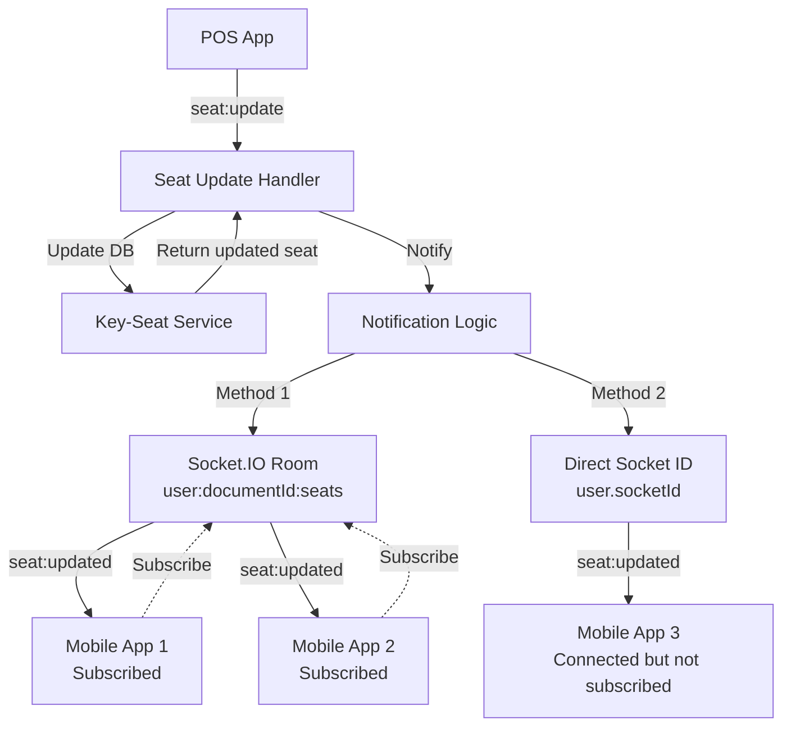

# Real-time Notification Architecture

## Overview

The POS seat realtime updates feature uses a **dual notification strategy** to ensure reliable delivery of seat updates to mobile apps:

1. **Socket.IO Rooms** (Primary) - For explicitly subscribed clients
2. **Direct Socket ID** (Fallback/Redundancy) - For all connected mobile apps

## Architecture Diagram



## Notification Methods

### Method 1: Socket.IO Rooms (Primary)

**How it works:**
- Mobile apps explicitly subscribe by emitting `seat:subscribe` event
- They join a user-specific room: `user:{documentId}:seats`
- When POS sends update, notification is broadcast to all sockets in that room
- Multiple mobile devices can be in the same room

**Advantages:**
- ✅ Explicit subscription model
- ✅ Supports multiple devices per user
- ✅ Efficient broadcasting to many clients
- ✅ Clean separation of concerns

**Code:**
```typescript
// Mobile app subscribes
socket.emit('seat:subscribe', {});
socket.join(`user:${documentId}:seats`);

// Notification
io.to(`user:${documentId}:seats`).emit('seat:updated', payload);
```

### Method 2: Direct Socket ID (Fallback/Redundancy)

**How it works:**
- User's socket ID is stored in `users.socketId` field on connection
- When POS sends update, notification is also sent directly to user's socket ID
- Works even if mobile app hasn't explicitly subscribed

**Advantages:**
- ✅ Guaranteed delivery to connected users
- ✅ No explicit subscription needed
- ✅ Useful for lifecycle events and system notifications
- ✅ Redundancy if room subscription fails

**Code:**
```typescript
// Store socket ID on connection
await strapi.documents('plugin::users-permissions.user').update({
  documentId: userDocumentId,
  data: { socketId: socket.id }
});

// Notification
io.to(user.socketId).emit('seat:updated', payload);
```

## Socket ID Storage

### POS Apps
- **Storage**: `key-seat.userSocketId`
- **Scope**: Per machine/seat
- **Purpose**: Track which POS machine is connected
- **Updated**: On connection and disconnection

### Mobile Apps
- **Storage**: `users.socketId`
- **Scope**: Per user
- **Purpose**: Direct notifications to user's mobile device
- **Updated**: On connection and disconnection

## Data Flow

### 1. POS Connection
```
POS connects → Authenticate → Store socket ID in key-seat.userSocketId
```

### 2. Mobile Connection
```
Mobile connects → Authenticate → Store socket ID in users.socketId
```

### 3. Mobile Subscription (Optional but Recommended)
```
Mobile emits 'seat:subscribe' → Join room 'user:{documentId}:seats'
```

### 4. POS Sends Update
```
POS emits 'seat:update' → Handler processes → Update database → Notify mobile apps
```

### 5. Mobile Notification (Dual Strategy)
```
Notification Logic:
├─ Method 1: Emit to room 'user:{documentId}:seats' (all subscribed devices)
└─ Method 2: Emit to user.socketId (direct to connected device)
```

## Why Dual Strategy?

### Scenario 1: Mobile App Explicitly Subscribes
- ✅ Receives via Room (Method 1)
- ✅ Receives via Direct Socket (Method 2) - redundant but harmless
- **Result**: Guaranteed delivery with redundancy

### Scenario 2: Mobile App Connects but Doesn't Subscribe
- ❌ Doesn't receive via Room (not subscribed)
- ✅ Receives via Direct Socket (Method 2)
- **Result**: Still receives notifications

### Scenario 3: Multiple Mobile Devices for Same User
- ✅ All devices in room receive via Method 1
- ⚠️ Only last connected device receives via Method 2 (socketId overwritten)
- **Result**: Room-based delivery ensures all devices get updates

### Scenario 4: System/Lifecycle Events
- Can use Direct Socket method to notify users
- Useful for plan changes, license updates, etc.
- No subscription required

## Use Cases

### Real-time Seat Updates (Current Implementation)
- **Primary**: Room-based (Method 1)
- **Fallback**: Direct socket (Method 2)
- **Why**: Ensures delivery even if subscription fails

### Plan Updates (Existing Feature)
- **Method**: Direct socket to POS machines
- **Storage**: `key-seat.userSocketId`
- **Event**: `plan:updated`

### Future: License Expiration Warnings
- **Method**: Direct socket to mobile apps
- **Storage**: `users.socketId`
- **Event**: `license:expiring`

### Future: System Announcements
- **Method**: Broadcast to all or direct to specific users
- **Storage**: `users.socketId`
- **Event**: `system:announcement`

## Best Practices

### For Mobile Apps
1. **Always subscribe explicitly** using `seat:subscribe` event
2. **Handle both subscription and direct notifications** (deduplicate if needed)
3. **Reconnect and resubscribe** on disconnection
4. **Store subscription state** locally

### For Backend
1. **Use rooms for feature-specific subscriptions** (seat updates, chat, etc.)
2. **Use direct socket for system-wide notifications** (plan changes, announcements)
3. **Always provide both methods** for critical notifications
4. **Clean up socket IDs** on disconnection

### For POS Apps
1. **No subscription needed** - just emit updates
2. **Handle connection state** properly
3. **Retry on failure** with exponential backoff

## Error Handling

### License Not Found Warning
```
[SeatUpdateHandler] No license/user found for seat {seatId}
```

**Causes:**
- Seat's license relation not populated
- License deleted but seat still exists
- Database inconsistency

**Solution:**
- ✅ Fixed by populating license in `updateSeatTelemetry`
- ✅ Added proper error handling and logging
- ✅ Graceful degradation (logs warning but doesn't crash)

### Socket ID Not Found
```
User socket ID not found, skipping direct notification
```

**Causes:**
- User disconnected
- Socket ID not updated yet
- User never connected

**Solution:**
- ✅ Room-based notification still works
- ✅ Logged as info, not error
- ✅ No impact on functionality

## Performance Considerations

### Room-based Notifications
- **Pros**: Efficient for broadcasting to many clients
- **Cons**: Requires explicit subscription management
- **Scalability**: Excellent (Socket.IO handles room management)

### Direct Socket Notifications
- **Pros**: Simple, no subscription needed
- **Cons**: One socket ID per user (last connection wins)
- **Scalability**: Good for moderate user counts

### Dual Strategy Impact
- **Overhead**: Minimal (one extra emit per update)
- **Network**: Negligible (same payload, different target)
- **Database**: One extra query to fetch user.socketId
- **Recommendation**: Keep both methods for reliability

## Configuration

### Socket.IO Room Naming Convention
```typescript
const roomName = `user:${userDocumentId}:seats`;
```

**Format**: `{entity}:{identifier}:{feature}`
- `user` - Entity type
- `{userDocumentId}` - Unique identifier
- `seats` - Feature/topic

**Examples:**
- `user:abc123:seats` - User's seat updates
- `user:abc123:licenses` - User's license updates
- `license:xyz789:seats` - License's seat updates

### Socket ID Field Names
- POS: `key-seat.userSocketId`
- Mobile: `users.socketId`

**Why different names?**
- POS: Multiple seats per user, need per-seat tracking
- Mobile: One socket per user, simpler model

## Testing

### Test Room-based Notifications
1. Connect mobile app
2. Subscribe: `socket.emit('seat:subscribe', {})`
3. Send POS update
4. Verify mobile receives `seat:updated` event

### Test Direct Socket Notifications
1. Connect mobile app (don't subscribe)
2. Send POS update
3. Verify mobile still receives `seat:updated` event

### Test Multiple Devices
1. Connect 2 mobile apps with same user
2. Subscribe both to seat updates
3. Send POS update
4. Verify both devices receive notification

### Test Disconnection Cleanup
1. Connect mobile app
2. Disconnect
3. Verify `users.socketId` is cleared
4. Verify no errors when POS sends update

## Monitoring

### Key Metrics to Track
- Room subscription count per user
- Direct socket notification success rate
- Notification delivery latency
- Failed notification attempts
- Socket ID cleanup rate

### Logs to Monitor
```
[SeatUpdateHandler] Notified mobile apps in room user:...:seats
[SeatUpdateHandler] Also sent direct notification to user socket ...
[SeatUpdateHandler] No license/user found for seat ... (investigate if frequent)
[ConnectionHandler] Cleared user socket ID for user ... (normal on disconnect)
```

## Future Enhancements

### 1. Notification Acknowledgment
- Mobile apps acknowledge receipt
- Retry if not acknowledged
- Track delivery success rate

### 2. Offline Queue
- Queue notifications for offline users
- Deliver on reconnection
- Configurable retention period

### 3. Notification Preferences
- User can configure which notifications to receive
- Per-device notification settings
- Do Not Disturb mode

### 4. Analytics
- Track notification delivery metrics
- User engagement with notifications
- Performance monitoring

## Summary

The dual notification strategy provides:
- ✅ **Reliability**: Multiple delivery paths
- ✅ **Flexibility**: Supports both subscription and direct models
- ✅ **Scalability**: Efficient room-based broadcasting
- ✅ **Simplicity**: Works with or without explicit subscription
- ✅ **Future-proof**: Easy to extend for new notification types

**Recommendation**: Keep both methods for production use. The redundancy is minimal and provides significant reliability benefits.
